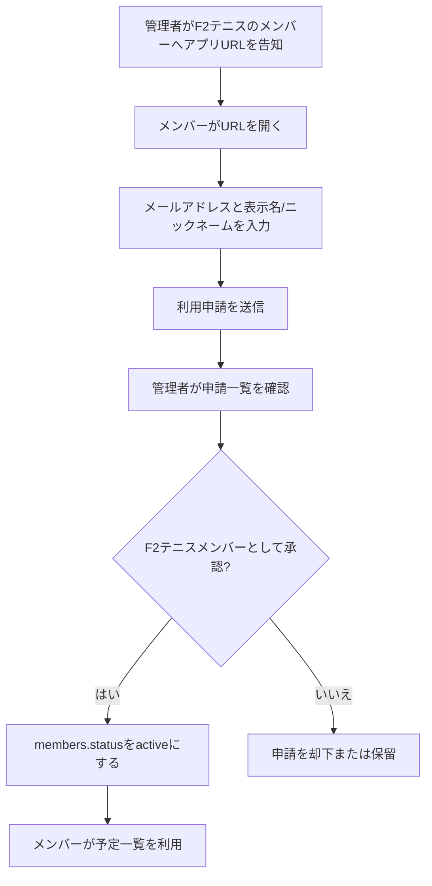
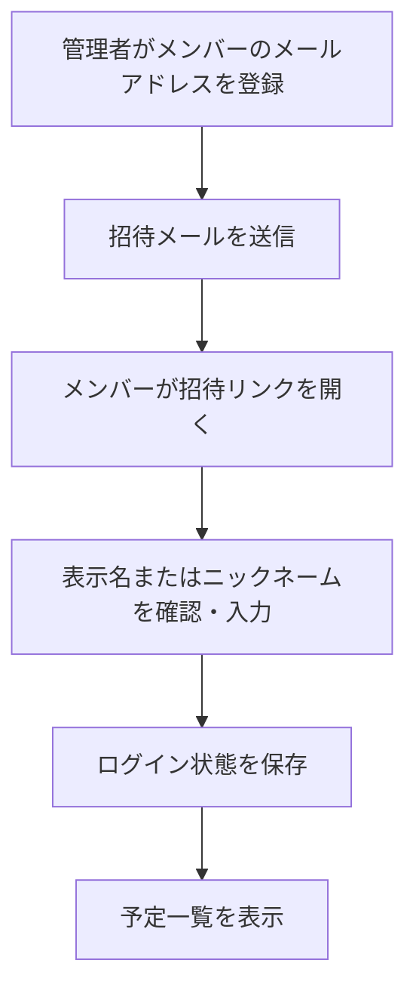
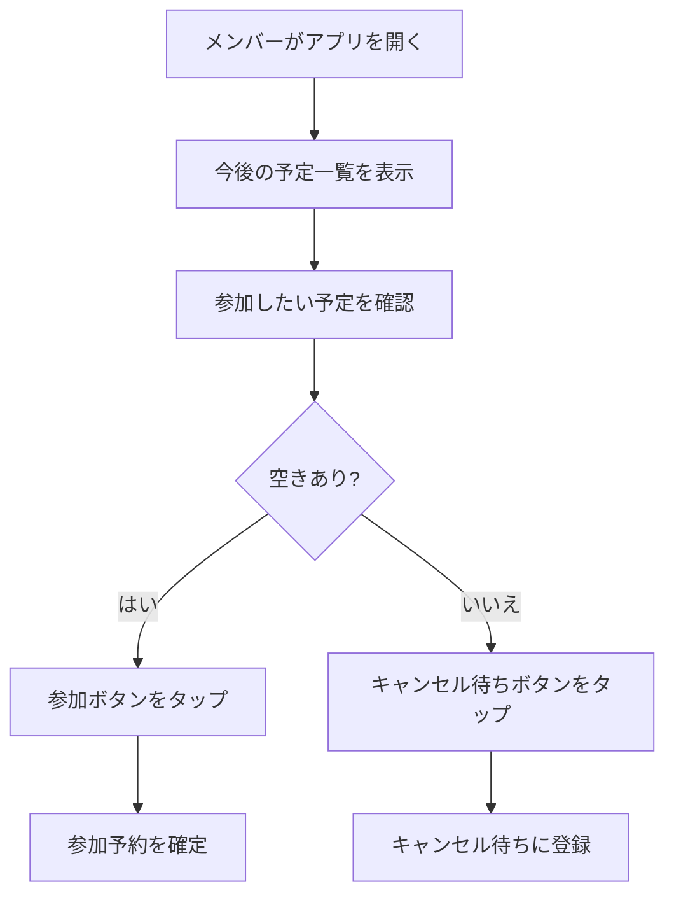
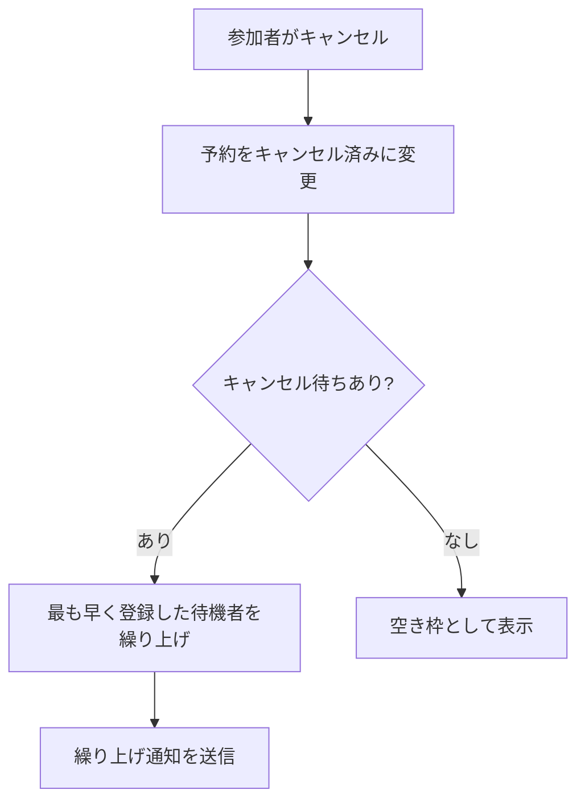

# F2テニス参加予約アプリ 設計書

Version: 0.1
Date: 2026-06-07

## 1. 目的

このアプリは、F2テニスのメンバーが練習・イベントへの参加予約をできるだけ簡単に行えるようにするための、サークル専用予約管理システムである。

アプリの表示名は以下とする。

- サークル名: F2テニス
- ログイン画面・サービス名: F2テニス参加予約
- アプリヘッダー・管理画面名: F2テニス予約管理

既存の一般向け予約・グループウェアサービスでは、広告表示やパスワード入力が参加予約の妨げになっている。特に利用頻度が低いメンバーほど、ログインや広告による手間で参加を諦める可能性がある。

本アプリでは、次の3点を最重要方針とする。

- 広告なし
- パスワードなし
- 参加予約が10秒で終わる

## 2. 設計原則

### 2.1 予約操作を最短にする

メンバーがアプリを開いたら、最初に今後の予定一覧を表示する。カレンダー型の複雑な画面ではなく、「次に参加できる予定」をすぐ選べる構成にする。

参加予約は、予定一覧または予定詳細から1タップで完了する。キャンセルも同じ場所から1タップで行える。

### 2.2 ログインを意識させない

通常のID/パスワード方式を主役にしない。初回登録後はログイン状態を長く保持し、再ログインが必要な場合もメール認証コードまたはマジックリンクで復帰できるようにする。

### 2.3 サークル運用に必要な機能だけに絞る

掲示板、アルバム、会計、汎用チャットなどのグループウェア機能は初期MVPには含めない。まずは参加率改善に直接効く、予定・予約・キャンセル・定員管理に集中する。

### 2.4 スマホ利用を前提にする

主な利用シーンは、スマホで予定を確認して参加可否を登録する流れである。PC画面も対応するが、UIの優先順位はスマホを上に置く。

## 3. 想定ユーザー

### 3.1 メンバー

サークルに所属し、練習やイベントへの参加・キャンセルを行うユーザー。

主な要望:

- 予定をすぐ見たい
- 参加できるかすぐ登録したい
- キャンセル待ちの状態を知りたい
- 雨天中止や場所変更を見逃したくない
- パスワードを覚えたくない

### 3.2 管理者

サークルの予定作成、定員設定、参加者確認、メンバー管理を行うユーザー。

主な要望:

- 練習予定を簡単に作りたい
- 定員やキャンセル待ちを自動管理したい
- 参加者一覧をすぐ確認したい
- メンバーを招待・停止したい
- 当日の人数把握を簡単にしたい

## 4. MVP範囲

MVPでは、参加予約の摩擦を減らすために必要な機能のみを実装する。

### 4.1 メンバー向け機能

- パスワードなしログイン
- 今後の予定一覧
- 予定詳細表示
- 参加予約
- 不参加・未定回答
- 予約キャンセル
- 定員到達時のキャンセル待ち登録
- 自分の予約状態表示
- 回答期限表示
- 参加状況集計表示
- 参加者・回答者リスト表示
- 予定変更・中止の確認

### 4.2 管理者向け機能

- 予定作成
- 予定編集
- 予定中止
- 予定削除
- 定員設定
- 参加者一覧確認
- キャンセル待ち一覧確認
- メンバー招待
- メンバー無効化

### 4.3 通知機能

初期MVPではメール通知を基本とする。

- 予約完了通知
- キャンセル完了通知
- キャンセル待ち登録通知
- キャンセル待ち繰り上げ通知
- 予定変更通知
- 予定中止通知
- 前日リマインド

### 4.4 MVPに含めない機能

- 汎用チャット
- 掲示板
- 写真共有
- 会計管理
- 出欠アンケート以外のフォーム
- 複数サークル対応
- 複雑な権限グループ
- アプリストア配信

## 5. 主要ユーザーフロー

### 5.1 初回利用案内

F2テニスのメンバーへの公開案内は、管理者が一人ひとり手入力する運用を基本にしない。管理者の負担を下げるため、以下の順で運用する。

1. 管理者がF2テニスの連絡手段でアプリURLを告知する
2. メンバーがアプリURLを開く
3. メンバーがメールアドレス、表示名またはニックネーム、所属を入力して利用申請する
4. 管理者が申請一覧を確認して承認する
5. 承認されたメンバーだけが予定一覧と予約機能を使える

この自己申請フローを基本とし、必要に応じて管理者による個別招待や一括招待も使えるようにする。

### 5.2 管理者による招待

表示名は、回答者リストや参加者一覧に表示される名前である。本名である必要はなく、サークル内で本人だと分かるニックネームでもよい。

### 5.3 参加予約

### 5.4 キャンセルと繰り上げ

## 6. 画面設計

### 6.1 メンバー向け画面

#### 予定一覧

アプリ起動時の最初の画面。直近の予定を日付順に表示する。

表示項目:

- 日付
- 時間
- 場所
- コート番号
- 定員
- 現在の参加人数
- 自分の状態
- 参加ボタンまたはキャンセルボタン

自分の状態:

- 未回答
- 参加中
- キャンセル待ち
- キャンセル済み

#### 予定詳細

予定ごとの詳細を表示する。

表示項目:

- タイトル
- 日時
- 回答期限
- 場所
- コート番号
- 定員
- 参加者数
- 不参加人数
- 未定/その他人数
- キャンセル待ち人数
- 回答済み人数
- 参加者一覧
- 不参加者一覧
- 未定/その他回答者一覧
- 備考
- 自分の予約状態
- 出欠メモ
- 最終更新日時
- 参加・不参加・未定・キャンセル操作

予定詳細では、サークルスクエアの出欠画面に近い情報として、回答期限、集計、回答者リストを同じ画面に表示する。メンバーは「今いつまでに回答すべきか」「今何人参加しているか」「誰が参加しているか」をすぐ確認できる。

#### 予定詳細の集計ブロック

回答期限の直下に、出欠状況の集計を表示する。

表示項目:

- 回答期限
- 定員
- 参加
- 不参加
- 未定/その他
- キャンセル待ち
- 未回答

初期MVPでは全体集計を必須とする。メンバー情報に性別や所属区分を持たせる場合は、以下の属性別集計も表示できるようにする。

- 男女別
- 所属別

属性別集計は運用上必要な場合のみ使う。メンバー登録時に不要な個人属性を必須にしない。

スマホ表示では、横長の表をそのまま表示しない。回答期限を最上部に大きく表示し、その下に「参加 4 / 定員 10」のような主要数値カードを置く。続けて、不参加、未定/その他、キャンセル待ち、未回答を小さな集計チップまたは2列グリッドで表示する。

PCまたは管理者画面では、必要に応じてスクリーンショットのような表形式の集計を表示してよい。ただし、メンバーがスマホで見る通常画面では、横スクロール前提の表を主UIにしない。

#### 回答者リスト

予定詳細の下部に、回答者リストを表示する。

表示項目:

- 表示名またはニックネーム
- 所属
- 出欠状態
- 出欠メモ
- 更新日時

フィルター:

- 回答者すべて
- 参加
- 不参加
- 未定/その他
- キャンセル待ち

参加者が当日の人数を把握しやすいよう、初期表示では「参加」と「キャンセル待ち」を優先して見せる。管理者画面では全回答を一覧できるようにする。

スマホ表示では、回答者リストを表形式にしない。1人1行のカードまたはコンパクトなリストとして表示し、表示名またはニックネーム、出欠アイコン、所属、メモ、更新日時を縦方向に収める。

回答者リストに表示する名前は、`members.name` の値を使う。管理者であっても一般メンバーであっても、表示ルールは同じである。デモ環境の「デモ管理者」はデモ用メンバーの表示名であり、本番では各メンバーが登録時に設定した表示名またはニックネームが表示される。

スマホでの初期表示順:

1. 参加者
2. キャンセル待ち
3. 未定/その他
4. 不参加

フィルターは画面上部の横スクロール可能なセグメントとして配置する。メンバーは「参加」だけをすぐ見られ、管理者は「すべて」へ切り替えて全回答を確認できる。

#### 自分の予約

自分が参加予定またはキャンセル待ちになっている予定だけを表示する。

### 6.2 管理者向け画面

#### 管理者ダッシュボード

管理者が当日・今週の予定と参加状況を確認する画面。

表示項目:

- 近日開催予定
- 参加者数
- キャンセル待ち人数
- 定員不足または定員超過の警告
- 中止・変更が必要な予定

#### 予定作成・編集

予定を作成または編集する画面。

入力項目:

- タイトル
- 開始日時
- 終了日時
- 回答期限
- 場所
- コート番号
- 定員
- 備考
- 公開状態
- 中止状態

回答期限の初期値は、開始日の2日前の22:00とする。例: 2026/6/21 13:00開始の予定であれば、回答期限の初期値は2026/6/19 22:00になる。管理者は必要に応じて回答期限を手動変更できる。

#### 予定削除

管理者は予定を削除できる。

削除は、誤操作や履歴確認に備えて、初期MVPでは物理削除ではなくソフト削除を基本とする。削除された予定はメンバー向けの予定一覧、予定詳細、自分の予約一覧には表示しない。管理者画面では必要に応じて削除済み予定を確認できるようにする。

削除操作の条件:

- adminのみ実行可能
- 削除前に確認ダイアログを表示する
- 参加者またはキャンセル待ちがいる予定を削除する場合は、参加者がいることを明示して再確認する
- 削除された予定では新規回答・回答変更を受け付けない
- 削除時に関連する予約・回答データは履歴として残す

中止と削除の使い分け:

- 中止: メンバーに「この予定は開催しない」と知らせたい場合
- 削除: 誤作成、重複作成、テスト予定など、メンバー向けに表示したくない場合

#### 参加者管理

予定ごとの参加者、キャンセル待ち、キャンセル済みメンバーを確認する画面。

操作:

- 参加者の手動追加
- 参加者の手動キャンセル
- キャンセル待ち順の確認
- CSV出力

#### メンバー申請管理

公開URLから自己申請したメンバーを確認し、承認・却下する画面。

表示項目:

- 申請日時
- メールアドレス
- 表示名またはニックネーム
- 所属
- 任意メモ
- 状態

操作:

- 承認
- 却下
- 保留
- 表示名または所属の修正

管理者ダッシュボードには、未承認申請件数を表示する。

#### メンバー管理

メンバーを招待・無効化する画面。

表示項目:

- 表示名またはニックネーム
- メールアドレス
- 権限
- 状態
- 最終ログイン日時

操作:

- 招待
- CSV一括登録または一括招待
- 表示名またはニックネームの編集
- 管理者権限付与
- 管理者権限解除
- 無効化

## 7. データ設計

初期構成ではSupabaseのPostgreSQLを利用する想定。

### 7.1 members

サークルメンバー情報。

| Column | Type | Description |
| --- | --- | --- |
| id | uuid | メンバーID |
| auth_user_id | uuid | Supabase AuthのユーザーID |
| name | text | 表示名またはニックネーム |
| email | text | メールアドレス |
| gender | text | male / female / other / undisclosed |
| affiliation | text | 所属区分 |
| role | text | member / admin |
| status | text | pending / invited / active / rejected / disabled |
| application_note | text | 利用申請時の任意メモ |
| approved_at | timestamptz | 承認日時 |
| approved_by | uuid | 承認者 |
| rejected_at | timestamptz | 却下日時 |
| rejected_by | uuid | 却下者 |
| created_at | timestamptz | 作成日時 |
| last_seen_at | timestamptz | 最終アクセス日時 |

`name` は回答者リスト、参加者一覧、管理者画面に表示される名前である。本名を必須にせず、サークル内で識別できるニックネームを許可する。

`gender` と `affiliation` は任意項目とする。集計に使う場合でも、サークル運用に不要であれば未設定でよい。

`pending` はURL告知から自己申請した未承認メンバーを表す。`invited` は管理者が招待済みだが、まだ本人の初回ログイン・承認が完了していない状態を表す。

### 7.2 events

練習・イベント情報。

| Column | Type | Description |
| --- | --- | --- |
| id | uuid | 予定ID |
| title | text | タイトル |
| starts_at | timestamptz | 開始日時 |
| ends_at | timestamptz | 終了日時 |
| response_deadline | timestamptz | 回答期限 |
| location | text | 場所 |
| court_name | text | コート番号・面 |
| capacity | integer | 定員 |
| note | text | 備考 |
| status | text | draft / published / cancelled / deleted |
| created_by | uuid | 作成者 |
| deleted_by | uuid | 削除者 |
| deleted_at | timestamptz | 削除日時 |
| created_at | timestamptz | 作成日時 |
| updated_at | timestamptz | 更新日時 |

### 7.3 reservations

参加予約とキャンセル待ちを表す。

| Column | Type | Description |
| --- | --- | --- |
| id | uuid | 予約ID |
| event_id | uuid | 予定ID |
| member_id | uuid | メンバーID |
| status | text | confirmed / declined / tentative / waitlisted / cancelled |
| waitlist_position | integer | キャンセル待ち順 |
| comment | text | 任意コメント |
| created_at | timestamptz | 初回登録日時 |
| updated_at | timestamptz | 更新日時 |

制約:

- 同一メンバーは同一予定に対して1つの回答だけを持つ
- confirmed数がcapacityを超えない
- waitlistedはcreated_at順で繰り上げる

ステータス定義:

- confirmed: 参加
- declined: 不参加
- tentative: 未定/その他
- waitlisted: キャンセル待ち
- cancelled: 参加またはキャンセル待ちを取り消した状態

### 7.4 invitations

招待情報。

| Column | Type | Description |
| --- | --- | --- |
| id | uuid | 招待ID |
| email | text | 招待先メールアドレス |
| role | text | member / admin |
| token_hash | text | 招待トークンのハッシュ |
| expires_at | timestamptz | 有効期限 |
| accepted_at | timestamptz | 承認日時 |
| created_by | uuid | 招待者 |
| created_at | timestamptz | 作成日時 |

### 7.5 notifications

通知履歴。

| Column | Type | Description |
| --- | --- | --- |
| id | uuid | 通知ID |
| member_id | uuid | 通知先メンバー |
| event_id | uuid | 関連予定 |
| type | text | reservation_confirmed等 |
| channel | text | email / push / line |
| status | text | pending / sent / failed |
| sent_at | timestamptz | 送信日時 |
| created_at | timestamptz | 作成日時 |

## 8. 予約ルール

### 8.1 参加予約

- 予定がpublishedで、回答期限前であれば予約できる
- confirmed人数がcapacity未満ならconfirmedになる
- confirmed人数がcapacity以上ならwaitlistedになる
- disabledメンバーは予約できない

### 8.2 不参加・未定回答

- 予定がpublishedで、回答期限前であれば不参加または未定/その他を回答できる
- 不参加はdeclinedとして保存する
- 未定/その他はtentativeとして保存する
- 既にconfirmedまたはwaitlistedの場合、不参加・未定へ変更できる
- confirmedからdeclinedまたはtentativeに変わる場合は、キャンセルと同様にキャンセル待ち繰り上げ処理を行う

### 8.3 キャンセル

- confirmedまたはwaitlistedの予約をcancelledに変更できる
- confirmedがキャンセルされた場合、waitlistedの先頭をconfirmedへ繰り上げる
- 繰り上げ対象者には通知する

### 8.4 回答期限

- 予定には回答期限を設定できる
- 新規予定作成時、回答期限の初期値は開始日の2日前の22:00とする
- 回答期限を過ぎた予定では、メンバー自身による参加・不参加・未定・キャンセル操作を原則不可とする
- 管理者は回答期限後も手動調整できる
- 回答期限が未設定の既存予定では、開始日の2日前の22:00を補完値として扱う
- フロントエンド、Supabase SQL関数、デモデータのすべてで同じ回答期限ルールを使う
- `response_deadline` がnullの場合でも、開始時刻そのものを回答期限として扱わない
- 補完値は、`starts_at` の日付から2日前に戻し、その日の22:00に設定する

### 8.5 集計

予定詳細では、以下の集計を表示する。

- 定員
- confirmed数
- declined数
- tentative数
- waitlisted数
- 未回答数

未回答数は、activeメンバー数から当該予定の回答済みメンバー数を引いて算出する。

属性別集計を使う場合は、members.genderまたはmembers.affiliationごとに同じ数値を表示する。

### 8.6 中止

- 管理者は予定をcancelledに変更できる
- 中止された予定では新規予約を受け付けない
- confirmedおよびwaitlistedのメンバーに通知する

### 8.7 削除

- 管理者は予定をdeletedに変更できる
- deletedの予定はメンバー向け画面に表示しない
- deletedの予定では新規予約・回答変更を受け付けない
- 削除時はdeleted_atとdeleted_byを記録する
- 削除済み予定の関連予約・回答は履歴として残す
- 参加者がいる予定を削除する場合は、管理者に強い確認を出す
- 削除通知は初期MVPでは任意とする。メンバーへ知らせる必要がある場合は、削除ではなく中止を使う

### 8.8 開始後の扱い

初期MVPでは、回答期限または開始時刻を過ぎた予定はメンバー自身の予約・キャンセル不可とする。将来的には「開始2時間前までキャンセル可」など、サークルルールに応じて変更できるようにする。

## 9. 認証設計

### 9.1 方針

パスワードを使わない認証を基本とする。

候補:

- メールOTP
- メールマジックリンク
- Googleログイン

初期MVPでは、Supabase AuthのメールOTPまたはマジックリンクを利用する。メンバーがGoogleアカウントを日常的に使っている場合はGoogleログインも追加する。

### 9.2 招待制

アプリは一般公開されたURLからアクセスできるが、予定一覧・予約機能を利用できるのは承認済みメンバーのみとする。

基本ルール:

- 管理者はF2テニスのメンバーへアプリURLを告知する
- メンバーはアプリURLから利用申請できる
- 利用申請時にメールアドレス、表示名またはニックネーム、所属を入力する
- 申請直後は `members.status = pending` または `invited` とし、予定一覧・予約機能は使えない
- 管理者が申請一覧から承認すると `members.status = active` になる
- activeメンバーだけが予定一覧・予約機能を使える
- 回答者リストには登録された表示名またはニックネームを表示する
- 管理者は必要に応じて、メールアドレス指定の個別招待もできる
- 既存メンバー一覧がある場合はCSVなどで一括招待できる

推奨運用:

- 通常運用: URL告知 + メンバー自己申請 + 管理者承認
- 初期移行時: CSV一括登録または一括招待
- 個別対応: 管理者がメールアドレスで個別招待

この設計により、管理者が全メンバーを一人ずつ入力する負担を避ける。

### 9.3 利用申請

メンバーは公開URLから利用申請を行う。

入力項目:

- メールアドレス
- 表示名またはニックネーム
- 所属
- 任意メモ

申請後の状態:

- 管理者承認待ちとして表示する
- 予定一覧や予約機能には進ませない
- 管理者には未承認申請件数を表示する

管理者操作:

- 承認
- 却下
- 保留
- 表示名・所属の修正

### 9.4 招待メール

本番環境では、管理者がメンバーを招待した時点で、招待先メールアドレスへ招待メールを送信する。

招待メールに含める内容:

- サークル予約アプリへの招待であること
- 招待リンク
- 招待リンクの有効期限
- 初回登録時に表示名またはニックネームを設定する案内
- パスワード不要で利用できること

デモ環境またはメール送信機能が未設定の開発環境では、実際のメールは送信しない。この場合、管理者画面には「デモ環境のため招待メールは送信されません」または「メール送信は未設定です」のような状態表示を出す。

本番で招待メールを送る方法は、以下のどちらかを採用する。

- Supabase Authの招待/マジックリンク機能を使う
- Supabase Edge Functionsからメール送信サービスを呼び出す

実装担当者は、メンバーを `members.status = invited` にするだけで完了扱いにしない。本番環境では、招待メール送信が成功したこと、または送信失敗が管理者に分かることを完了条件に含める。

### 9.5 セッション保持

ログイン後は長めにセッションを保持する。メンバーが毎回ログインしなくて済むようにする。

ただし、管理者画面では重要操作の前にセッション有効性を確認する。

## 10. 権限設計

### 10.1 member

できること:

- 予定一覧を見る
- 予定詳細を見る
- 自分の予約を作成する
- 自分の予約をキャンセルする
- 自分の予約状態を見る

できないこと:

- 他人の予約を変更する
- 予定を作成・編集する
- メンバーを招待・無効化する

### 10.2 admin

できること:

- memberの操作すべて
- 予定を作成・編集・中止する
- 参加者一覧を見る
- 予約を手動調整する
- メンバーを招待・無効化する

### 10.3 Row Level Security

SupabaseではRow Level Securityを有効化する。

基本方針:

- membersは本人情報と必要最小限の他メンバー表示名のみ参照可能
- eventsはactiveメンバーがpublished予定を参照可能
- reservationsはactiveメンバーが自分の予約を操作可能
- adminはサークル内データを管理可能

## 11. 技術構成

### 11.1 フロントエンド

- React
- Vite
- TypeScript
- GitHub Pages

理由:

- 小規模アプリに適している
- GitHub Pagesで静的配信できる
- SupabaseのJavaScript SDKと相性がよい
- PWA化しやすい

### 11.2 バックエンド

- Supabase Auth
- Supabase PostgreSQL
- Supabase Edge Functions

Edge Functionsの用途:

- 招待メール送信
- 通知送信
- キャンセル待ち繰り上げ処理
- 管理者専用処理

### 11.3 ホスティング

- GitHub Pages

注意:

- GitHub Pagesは静的サイト公開用であり、サーバー側処理は置かない
- 秘密キーはGitHub Pagesに埋め込まない
- 公開してよいSupabase anon keyのみフロントエンドに設定する
- Service Role KeyはEdge Functions側だけで使う
- GitHub PagesでSPAを公開する場合、直URLリロードやメールログイン後の `/events` などで404にならないようにする
- 対応方法は、`HashRouter` を使う、または `BrowserRouter` と `404.html` フォールバックを組み合わせる
- project pagesで公開する場合、`VITE_APP_BASE_PATH` をリポジトリ名に合わせ、ビルド後のasset URLが正しいことを確認する
- メール認証のリダイレクトURLは、GitHub Pagesの公開URLとルーティング方式に合わせる

## 12. UI方針

### 12.0 スマホ優先レイアウト

主な利用端末はiPhoneなどのスマートフォンである。すべての主要画面はスマホ幅を基準に設計し、PC表示は補助的に広げる。

スマホでの予定詳細は、上から次の順に表示する。

1. 予定名、日時、場所
2. 回答期限
3. 自分の回答状態と主要アクション
4. 参加人数 / 定員の大きな集計
5. 不参加、未定/その他、キャンセル待ち、未回答の小集計
6. 参加者リスト
7. フィルター付き回答者リスト
8. 備考

スマホでは、横幅に収まらない表を主UIにしない。集計はカード、チップ、2列グリッドで表示する。回答者リストはテーブルではなくカード型またはリスト型にする。

### 12.1 予定カード

予定一覧では、各予定をカード形式で表示する。

優先して見せる情報:

- 日付
- 時間
- 回答期限
- 場所
- 参加人数 / 定員
- 自分の状態
- 参加またはキャンセル操作

スマホでは、予定カード内の主操作ボタンを親指で押しやすい位置に置く。参加可能な予定では「参加する」を最も目立たせ、既に参加中の場合は「参加中」と「キャンセル」を分けて表示する。

### 12.2 予定詳細のスマホ表示

予定詳細では、回答期限と現在の参加人数を最初に把握できるようにする。

推奨レイアウト:

- 回答期限: 画面上部に「回答期限 6/21 00:00」のように明示
- 自分の状態: 「未回答」「参加中」「キャンセル待ち」などをラベル表示
- 主操作: 参加、不参加、未定/その他、キャンセルをボタンとして配置
- 集計: 「参加 4/10」を大きく表示し、その他の回答状態は小さく表示
- 回答者リスト: 参加者を先に表示し、必要に応じてフィルターで切り替える

PCでは表形式を使ってよいが、スマホでは表を横スクロールさせるより、縦方向に読めるレイアウトを優先する。

参加済みまたはキャンセル待ち状態のユーザーには、予定詳細の主操作として再度「参加する」を表示しない。参加済みの場合は「参加中」とキャンセル操作、キャンセル待ちの場合は「キャンセル待ち」とキャンセル操作を明確に表示する。これにより、同じ予定に再度参加操作できるように見える混乱を避ける。

### 12.3 ボタン

主操作:

- 参加する
- キャンセル
- キャンセル待ち

状態表示:

- 参加中
- キャンセル待ち
- 締切
- 中止

### 12.4 10秒予約のための条件

以下を満たすことをUI完成条件とする。

- アプリ起動後、予定一覧が最初に出る
- 参加可能な予定が一目で分かる
- 予定詳細を開かなくても参加できる
- 予定詳細を開けば、回答期限・集計・参加者リストが分かる
- 予約完了後に余計な画面遷移をしない
- 予約状態が即座に反映される

## 13. 通知設計

### 13.1 初期MVP

メール通知を実装する。

通知対象:

- 予約完了
- キャンセル完了
- キャンセル待ち登録
- キャンセル待ち繰り上げ
- 予定変更
- 予定中止
- 予定削除
- 前日リマインド

### 13.2 将来対応

- LINE通知
- Web Push通知
- カレンダー連携

## 14. 運用方針

### 14.1 リポジトリ

初期開発はGitHubで管理する。

候補:

- private repositoryで開発
- GitHub Pages公開時に必要ならpublic化
- またはGitHub Pro/Team等でprivate repositoryからGitHub Pages公開

### 14.2 本番データ

本番データはSupabaseに置く。GitHubには個人情報、予約データ、秘密キーを保存しない。

### 14.3 バックアップ

初期MVPでは手動エクスポートを想定する。

将来的には以下を検討する。

- Supabaseの定期バックアップ
- 予約データのCSV出力
- 管理者向け月次エクスポート

## 15. 実装ロードマップ

### Phase 1: 設計と雛形

- 設計書作成
- React/Vite/TypeScriptの雛形作成
- GitHub Pages公開設定
- Supabaseプロジェクト作成
- 環境変数設計

### Phase 2: 認証とメンバー管理

- Supabase Auth導入
- パスワードなしログイン
- 招待制メンバー登録
- 権限判定

### Phase 3: 予定と予約

- 予定一覧
- 予定詳細
- 参加予約
- キャンセル
- 定員管理
- キャンセル待ち

### Phase 4: 管理者機能

- 予定作成
- 予定編集
- 参加者一覧
- メンバー招待

### Phase 5: 通知と運用

- メール通知
- 前日リマインド
- 予定変更・中止通知
- CSV出力

### Phase 6: 使いやすさ改善

- PWA対応
- ホーム画面追加案内
- LINE通知検討
- カレンダー連携検討

## 16. 公開前修正要件

GitHub公開版に進む前に、以下を必ず修正・確認する。

### 16.1 P1: GitHub Pagesルーティング

GitHub Pages上で、以下のURLを直接開いてもアプリが表示されること。

- `/`
- `/login`
- `/events`
- `/events/:eventId`
- `/my`
- `/admin`
- `/admin/events/:eventId`
- `/admin/members`

対応方針:

- `HashRouter` を使う場合は、公開URLを `/#/events` 形式に統一する
- `BrowserRouter` を使う場合は、GitHub Pages用の `404.html` フォールバックを用意する
- project pagesの場合は、`VITE_APP_BASE_PATH` を `/<repository-name>/` に設定する
- ビルド後の `index.html` で、JS/CSS assetのURLが公開パスと一致していることを確認する
- Supabase AuthのメールリダイレクトURLも、公開URLとルーティング方式に合わせる

### 16.2 P2: 回答期限フォールバック

回答期限の仕様を、全レイヤーで統一する。

- 新規予定作成時の初期値: 開始日の2日前 22:00
- `response_deadline` がnullの場合の補完値: 開始日の2日前 22:00
- フロントエンド表示、ボタンの締切判定、Supabase SQL関数、デモデータで同じ計算を使う
- `response_deadline ?? starts_at` のように開始時刻を回答期限代わりに使う処理は入れない

### 16.3 P3: 予定詳細の参加済みUI

予定詳細画面で、参加済みまたはキャンセル待ちのユーザーに再度「参加する」ボタンを見せない。

- confirmedの場合: 「参加中」を表示し、主操作はキャンセルにする
- waitlistedの場合: 「キャンセル待ち」を表示し、主操作はキャンセルにする
- 未回答、declined、tentative、cancelledの場合のみ、参加またはキャンセル待ち操作を表示する

### 16.4 P3: デモデータの仕様同期

デモ画面は本番仕様の確認にも使うため、デモデータも最新仕様に合わせる。

- デモ予定の回答期限を開始日の2日前22:00にする
- デモ画面の表記も「F2テニス参加予約」「F2テニス予約管理」に合わせる
- デモ環境で招待メールが送信されないことを管理者画面で明示する

## 17. 未決定事項

今後決める必要がある項目。

- 参加予約の締切時刻
- キャンセル待ち繰り上げ時の自動確定可否
- 不参加・未定回答を必須にするか
- 男女別・所属別集計を使うか
- 性別・所属区分をメンバー情報に持たせるか
- 友人・体験参加者の扱い
- 参加費管理を将来含めるか
- LINE通知を必須にするか
- 管理者を何人にするか
- GitHubリポジトリをpublicにするかprivateにするか

## 18. 初期MVPの完成条件

初期MVPは、以下を満たした時点で完成とする。

- 招待済みメンバーだけがログインできる
- パスワードなしでログインできる
- 今後の予定一覧をスマホで見られる
- 予定一覧から10秒以内に参加予約できる
- 予定詳細で回答期限を確認できる
- 予定詳細で参加、不参加、未定/その他、キャンセル待ちの集計を確認できる
- 予定詳細で誰が参加しているか確認できる
- 参加予約をキャンセルできる
- 定員到達後はキャンセル待ちになる
- キャンセル時にキャンセル待ちが繰り上がる
- 管理者が予定を作成・編集できる
- 管理者が誤作成・重複作成した予定を削除できる
- 管理者が参加者一覧を確認できる
- 広告が一切表示されない
- アプリ名が「F2テニス参加予約」、管理画面名が「F2テニス予約管理」になっている
- GitHub Pagesで直URLアクセス、リロード、メールログイン後リダイレクトが動作する
- 回答期限の初期値とnull補完値が開始日の2日前22:00で統一されている
- 参加済みユーザーに、予定詳細で再度「参加する」ボタンを表示しない
- デモデータの回答期限と表示名が本番仕様に揃っている
